<div align="center">

# Adversarial Threats to Safety-Critical Medical AI

### A Security Assessment of 20 Deep Learning Tumour Detectors in Brain MRI and Kidney CT

**Oudoum Ali Houmed** · Gazi University, Ankara, Turkey

[](paper/adversarial-threats-medical-ai.pdf)
[](#-reproducing-the-experiments)
[](requirements.txt)
[](LICENSE)

*20 architectures × 2 imaging modalities × 2 attacks × 3 perturbation budgets = **280 model–condition evaluations***

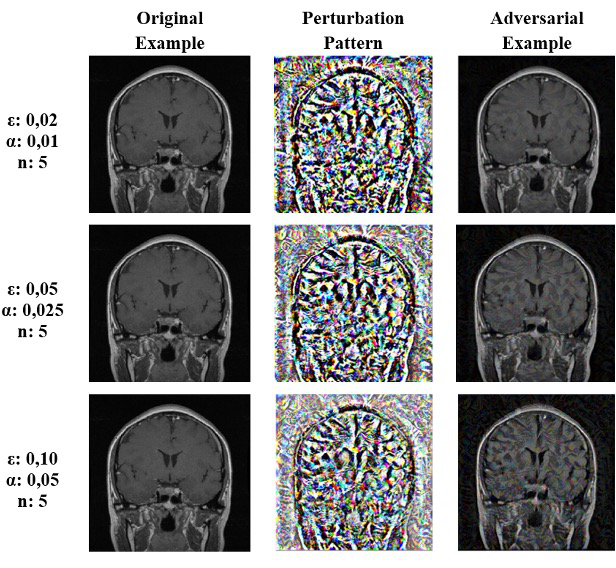

<sub>A brain-MRI tumour scan before and after a PGD attack at three budgets. To a radiologist the images are identical; to the model they are not.</sub>

</div>

---

## 📌 TL;DR

Deep learning models now detect tumours on medical images with **96–100 % accuracy**. This project shows that the same models can be made to fail **silently and almost completely** by adding noise that no human can see.

| | Result |
|---|---|
| 🧠 **Clean accuracy** | Every one of the 20 models exceeds **96 %** (17 of 20 CT models reach 100 %) |
| ⚡ **One FGSM step, ε = 0.05** | Average accuracy drops by **54.3 points on MRI** and **77.6 points on CT** |
| 🎯 **Five PGD steps, ε = 0.10** | **19 / 20 MRI** models and **all 20 CT** models fall to **0 – 1.7 %** accuracy |
| 🏥 **Modality matters** | MRI models are **~2× more robust** than CT models (Wilcoxon, *p*<sub>Holm</sub> < 0.05 in all 6 comparisons) |
| 🏗️ **Architecture matters, a little** | Inception backbones are most robust (InceptionV3: 37.6 %), MobileNetV3Small the least (8.1 %) – a **4.6× spread**, yet **no model is safe** at ε = 0.10 |
| 👁️ **Image quality ≠ attack strength** | At the *same* SSIM ≈ 0.75, FGSM leaves 22–44 % accuracy while PGD leaves **< 3 %** – quality-metric detectors cannot tell them apart |

> **Bottom line:** choosing a "better" network is a mitigation, not a defence. Clinical AI needs explicit defences (e.g. adversarial training) **and** integrity protection of the whole imaging pipeline.

---

## 📚 Table of contents

1. [Why this matters](#-why-this-matters)
2. [Threat model](#-threat-model)
3. [Study design](#-study-design)
4. [How the attacks work](#-how-the-attacks-work)
5. [Results](#-results)
6. [What this means in practice](#-what-this-means-in-practice)
7. [Limitations](#-limitations)
8. [Repository structure](#-repository-structure)
9. [Code walkthrough](#-code-walkthrough)
10. [Reproducing the experiments](#-reproducing-the-experiments)
11. [Citation](#-citation)

---

## 🩺 Why this matters

Radiology is one of the areas where AI is already deployed: in 2018 the US FDA approved the first **autonomous** AI diagnostic device. Deployment changes the risk:

- A model that is merely **inaccurate** fails *visibly and randomly*.
- A model that is **attacked** fails *silently, confidently, and in a direction chosen by the attacker*.

**Adversarial examples** are inputs changed by a tiny, carefully computed perturbation. The change is invisible to a radiologist, yet it reliably flips the model's decision. This makes insurance fraud, manipulated clinical-trial data or targeted misdiagnosis possible.

Earlier studies usually looked at **one** modality, **a few** models or **one** attack budget. That makes it impossible to tell whether vulnerability comes from the *imaging modality*, the *architecture* or the *attack budget*. This work changes all four factors together in a **fully factorial design**, so each effect can be isolated and tested statistically.

---

## 🛡️ Threat model

<p align="center">
  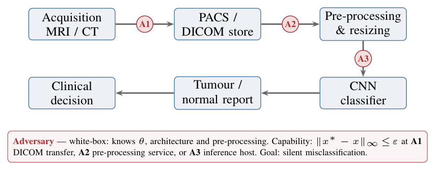
</p>

The classifier is only **one stage of a longer clinical pipeline**. An attacker can modify pixels at any of three transfer points *before* the model sees the image:

| Point | Where | Example |
|---|---|---|
| **A1** | DICOM transfer to/from the PACS archive | tampering with stored studies |
| **A2** | Pre-processing / anonymisation service | compromised hospital middleware |
| **A3** | Inference host | malware on the AI server |

| Property | Assumption |
|---|---|
| **Goal** | *Untargeted* misclassification: any wrong label, while the change stays imperceptible |
| **Knowledge** | *White-box*: architecture, trained weights θ, pre-processing and loss are known (weights of ImageNet backbones and many clinical checkpoints are public) |
| **Capability** | Change every pixel by at most ε: $\lVert x^\ast - x\rVert_\infty \le \varepsilon$. The model, training data and labels cannot be touched |

White-box is the **strongest realistic** attacker, so the results are an **upper bound** on how much damage an attacker can do.

---

## 🔬 Study design

<p align="center">
  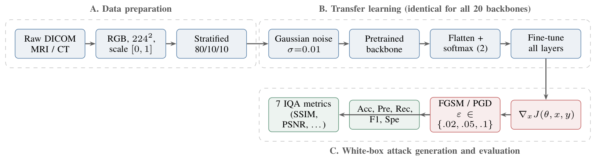
</p>

Stages **A** and **B** are *identical* for every architecture and both datasets. The only factors that change in stage **C** are the **backbone**, the **modality**, the **attack** and the **budget ε**.

### Datasets

Both public datasets are reduced to the same binary task, **Normal vs Tumour**. Sample sizes are similar and pre-processing is identical, so the two modalities can be compared directly.

| Dataset | Source | Normal (0) | Tumour (1) | Total | Test set |
|---|---|---:|---:|---:|---:|
| **Brain Tumour MRI** | [Kaggle – masoudnickparvar](https://www.kaggle.com/datasets/masoudnickparvar/brain-tumor-mri-dataset) (figshare + SARTAJ + Br35H) | 2 000 | 5 023 | 7 023 | 702 |
| **CT Kidney** | [Kaggle – nazmul0087](https://www.kaggle.com/datasets/nazmul0087/ct-kidney-dataset-normal-cyst-tumor-and-stone) (hospitals in Dhaka, Bangladesh) | 5 077 | 2 283 | 7 360 | 736 |

- **MRI:** glioma, meningioma and pituitary are merged into *Tumour*; "no tumour" becomes *Normal*.
- **CT:** only *Normal* and *Tumor* are kept; cyst and stone images are discarded.
- **Pre-processing:** RGB → 224 × 224 → scaled to [0, 1] → stratified **80 / 10 / 10** split (seed 42).
- The datasets are imbalanced in **opposite directions** (MRI 71.5 % tumour, CT 69.0 % normal). Accuracy is therefore always reported together with **recall** and **specificity**.

### 20 ImageNet-pretrained architectures (six families)

| Family | Models |
|---|---|
| Xception | Xception |
| VGG | VGG16, VGG19 |
| DenseNet | DenseNet121, DenseNet169, DenseNet201 |
| EfficientNetV2 | B0, B1, B2, B3, S |
| Inception | InceptionV3, Inception-ResNet-V2 |
| Mobile / NAS | MobileNet, MobileNetV2, MobileNetV3Small, NASNetMobile |
| ResNet V2 | ResNet50V2, ResNet101V2, ResNet152V2 |

They range from **0.9 M** (MobileNetV3Small) to **58 M** (ResNet152V2) backbone parameters. Every model uses the **same head and the same training recipe**, so any difference in robustness comes from the backbone, not from the training:

```
input (224×224×3) → GaussianNoise(σ=0.01, training only) → backbone preprocess_input
                  → pretrained backbone → Flatten → Dense(2, softmax)
```

| Phase | Trainable | Optimiser | Regularisation | Stopping |
|---|---|---|---|---|
| **1. Feature extraction** | head only (backbone frozen) | Adam, lr = 1e-4 | – | early stopping, patience 20 |
| **2. Fine-tuning** | all layers | Adam, lr = 1e-5 | elastic-net on Conv2D kernels (L1 = 1e-7, L2 = 1e-6) | early stopping, patience 20 |

### Attack configurations

| Attack | S1 | S2 | S3 |
|---|---|---|---|
| **FGSM** | ε = 0.02 | ε = 0.05 | ε = 0.10 |
| **PGD** | ε = 0.02, α = 0.010, n = 5 | ε = 0.05, α = 0.025, n = 5 | ε = 0.10, α = 0.050, n = 5 |
| **8-bit equivalent** | ±5.1 grey levels | ±12.8 grey levels | ±25.5 grey levels |

Every model is evaluated on the clean test set and under all 6 attack settings: 2 datasets × 20 models × (1 + 6) = **280 evaluations**, each with **5 metrics** (accuracy, precision, recall, F1, specificity).

### Statistical analysis

- **Architecture ranking:** Friedman test over the 12 adversarial conditions, Iman–Davenport correction, Nemenyi post-hoc test (critical difference CD = 8.56 mean-rank units).
- **Modality and attack effects:** one-sided **Wilcoxon signed-rank** tests paired by architecture (n = 20), **Holm–Bonferroni** correction over 12 tests, rank-biserial effect size $r_{rb}$.
- **Visibility:** 7 full-reference image-quality metrics (SSIM, MS-SSIM, UQI, VIFP, PSNR, MSE, RMSE) between each adversarial image and its original.

---

## ⚔️ How the attacks work

Both attacks use the **gradient of the loss with respect to the input image**, $\nabla_x J(\theta, x, y)$. It shows which way each pixel should move to make the model more wrong.

<p align="center">
  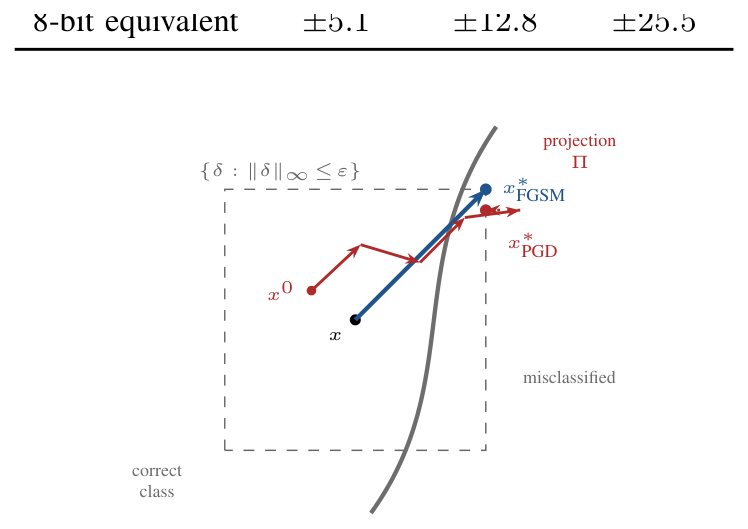
</p>

**FGSM – Fast Gradient Sign Method** (Goodfellow et al.) takes **one** step of size ε:

$$x^\ast = \mathrm{clip}_{[0,1]}\big(x + \varepsilon \cdot \mathrm{sign}(\nabla_x J(\theta, x, y))\big)$$

It is cheap (one gradient) but crude: it jumps to a fixed corner of the ε-ball.

**PGD – Projected Gradient Descent** (Madry et al.) takes **n smaller steps** of size α and after each one **projects** back into the allowed ε-ball $S = \{\delta : \lVert\delta\rVert_\infty \le \varepsilon\}$:

$$x^{t+1} = \Pi_{x+S}\big(x^{t} + \alpha \cdot \mathrm{sign}(\nabla_x J(\theta, x^{t}, y))\big)$$

Because it follows the loss surface, PGD finds a **far more damaging point inside the same budget**. That is why five PGD steps at ε = 0.02 hurt more than one FGSM step at ε = 0.05.

---

## 📊 Results

### 1. Clean baselines: near-perfect

On clean images the task is close to saturated. **CT:** 17 / 20 models reach 100 % accuracy (mean 99.98 %). **MRI:** every model exceeds 96 %; ResNet50V2 is best (99.72 %) and MobileNetV3Small weakest (97.29 %). The collapse shown below is therefore **not caused by undertrained models**.

### 2. Everything breaks, and PGD breaks it faster

<p align="center">
  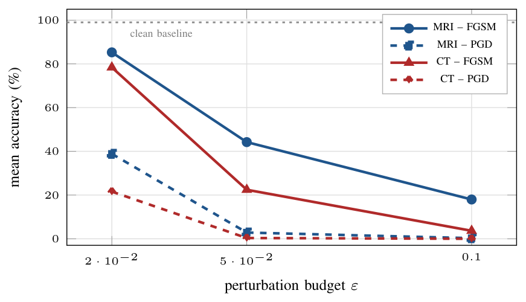
</p>

Mean accuracy (%) over the 20 architectures. *n < 10 %* = number of models left effectively destroyed.

| Dataset | Attack | ε | Mean | SD | Range | n < 10 % |
|---|---|---|---:|---:|---|---:|
| **MRI** | FGSM | 0.02 | 85.29 | 9.92 | 51.7 – 94.0 | 0 |
| | | 0.05 | 44.23 | 19.63 | 13.1 – 71.9 | 0 |
| | | 0.10 | 17.98 | 17.30 | 1.6 – 49.2 | 11 |
| | PGD | 0.02 | 38.86 | 16.26 | 7.9 – 62.0 | 1 |
| | | 0.05 | 2.85 | 2.10 | 0.1 – 7.4 | **20** |
| | | 0.10 | 0.28 | 0.50 | 0.0 – 1.7 | **20** |
| **CT** | FGSM | 0.02 | 78.42 | 21.05 | 16.0 – 98.5 | 0 |
| | | 0.05 | 22.43 | 15.87 | 0.1 – 56.9 | 6 |
| | | 0.10 | 3.66 | 5.45 | 0.0 – 17.8 | 17 |
| | PGD | 0.02 | 21.59 | 13.65 | 0.7 – 44.3 | 6 |
| | | 0.05 | 0.35 | 0.71 | 0.0 – 2.7 | **20** |
| | | 0.10 | **0.00** | 0.00 | 0.0 – 0.0 | **20** |

- **FGSM, ε = 0.02** (±5 grey levels) already costs 14 points on MRI and 22 on CT.
- **PGD, ε = 0.05:** all **40** model–dataset pairs are below 10 %.
- **PGD, ε = 0.10:** every one of the 20 CT models misclassifies **every** test image.

### 3. Every model, every condition

<p align="center">
  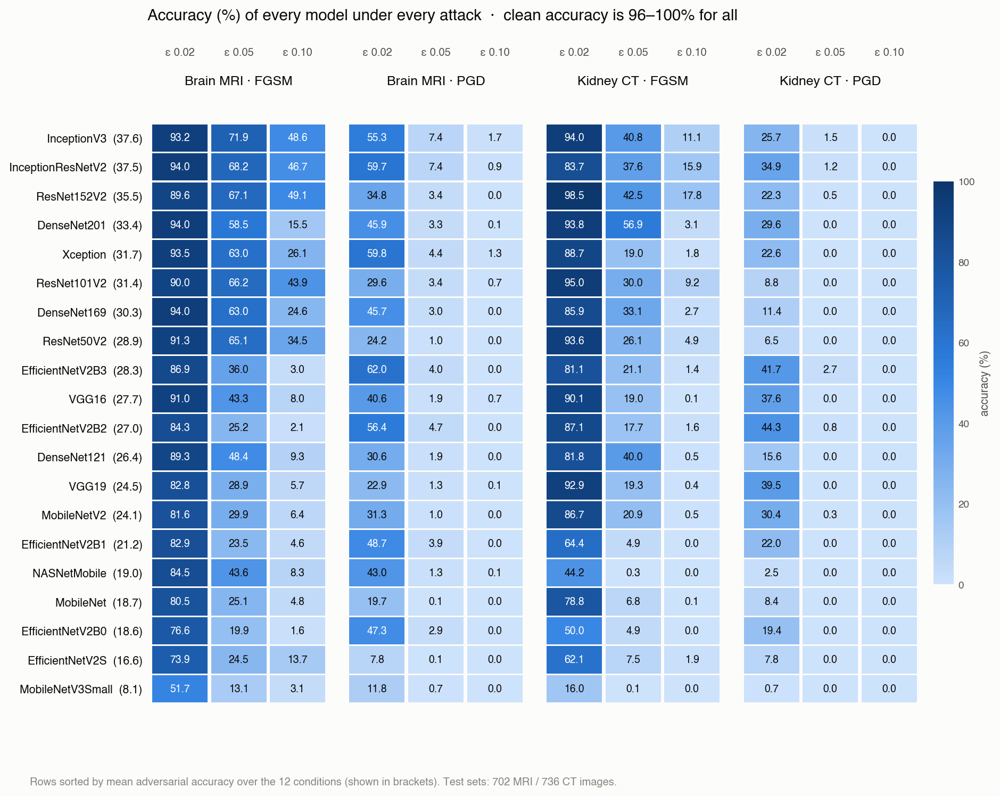
</p>

<details>
<summary><b>Per-model curves from the paper (click to expand)</b></summary>

<p align="center">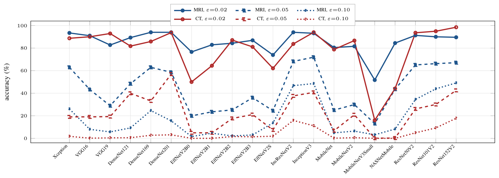</p>
<p align="center"><sub>Per-model accuracy under <b>FGSM</b>. The MobileNetV3Small trough and the Inception/ResNet152V2 peaks are visible at every budget.</sub></p>

<p align="center">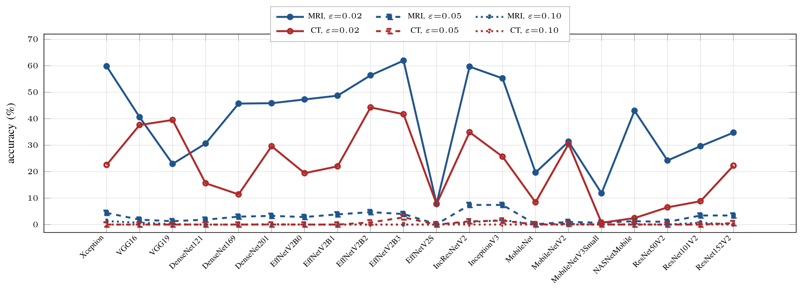</p>
<p align="center"><sub>Per-model accuracy under <b>PGD</b> (note the compressed y-axis). At ε = 0.10 the CT curve is identically zero.</sub></p>

</details>

The full per-model numbers (all 5 metrics) are in [`results/all_results.csv`](results/all_results.csv).

### 4. Which architecture is most robust?

Ranking by mean accuracy over all **12 adversarial conditions** (2 datasets × 2 attacks × 3 budgets). *r* = mean Friedman rank (1 = most robust).

| # | Model | Acc (%) | r | | # | Model | Acc (%) | r |
|---|---|---:|---:|---|---|---|---:|---:|
| 1 | **InceptionV3** | **37.60** | 3.75 | | 11 | EfficientNetV2B2 | 27.02 | 9.75 |
| 2 | **Inception-ResNet-V2** | **37.53** | 4.33 | | 12 | DenseNet121 | 26.45 | 11.38 |
| 3 | ResNet152V2 | 35.47 | 6.38 | | 13 | VGG19 | 24.49 | 11.62 |
| 4 | DenseNet201 | 33.40 | 7.00 | | 14 | MobileNetV2 | 24.10 | 11.75 |
| 5 | Xception | 31.67 | 7.29 | | 15 | EfficientNetV2B1 | 21.24 | 13.46 |
| 6 | ResNet101V2 | 31.41 | 7.92 | | 16 | NASNetMobile | 18.97 | 13.67 |
| 7 | DenseNet169 | 30.29 | 9.21 | | 17 | MobileNet | 18.70 | 15.54 |
| 8 | ResNet50V2 | 28.93 | 10.25 | | 18 | EfficientNetV2B0 | 18.55 | 14.96 |
| 9 | EfficientNetV2B3 | 28.32 | 9.08 | | 19 | EfficientNetV2S | 16.61 | 15.00 |
| 10 | VGG16 | 27.70 | 10.08 | | 20 | *MobileNetV3Small* | *8.11* | *17.58* |

<p align="center">
  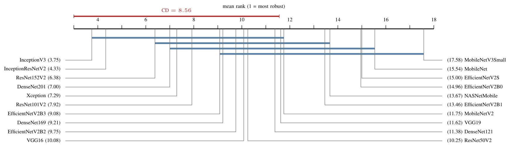
</p>

- The **Friedman test** rejects "all architectures are equally robust": χ²<sub>F</sub>(19) = 93.4, *p* = 8.3 × 10⁻¹².
- The **Nemenyi post-hoc test** (CD = 8.56) shows the two **Inception** backbones are significantly more robust than the six weakest (EfficientNetV2B1, NASNetMobile, EfficientNetV2B0, EfficientNetV2S, MobileNet, MobileNetV3Small).
- **Neighbouring ranks are not distinguishable.** The defensible claim is about **families**: multi-branch Inception backbones at the robust end, lightweight depthwise-separable mobile backbones at the fragile end.
- The 4.6× spread matters for model selection, but even the best model is **below 2 %** under PGD at ε = 0.10.

### 5. MRI vs CT: modality matters

At ε ≥ 0.05, MRI beats CT for **all 20 architectures without exception** (rank-biserial $r_{rb}$ = 1.00).

| Comparison | ε | Median Δ (points) | $r_{rb}$ | *p*<sub>Holm</sub> |
|---|---|---:|---:|---:|
| MRI > CT, FGSM | 0.02 | 3.21 | 0.46 | 3.8 × 10⁻² |
| | 0.05 | 18.45 | 1.00 | 1.1 × 10⁻⁵ |
| | 0.10 | 8.49 | 1.00 | 1.1 × 10⁻⁵ |
| MRI > CT, PGD | 0.02 | 16.97 | 0.90 | 2.5 × 10⁻⁴ |
| | 0.05 | 2.35 | 1.00 | 2.5 × 10⁻⁴ |
| | 0.10 | 0.00 | 1.00 | 1.1 × 10⁻² |

All six **attack** comparisons also confirm that **PGD is stronger than FGSM** at the same budget ($r_{rb}$ = 1.00 throughout). The **more accurate** group on clean data (CT) is the **more fragile** group under attack. A saturated clean score may even signal that the decision boundary passes very close to the data.

### 6. You cannot "see" how dangerous an attack is

<p align="center">
  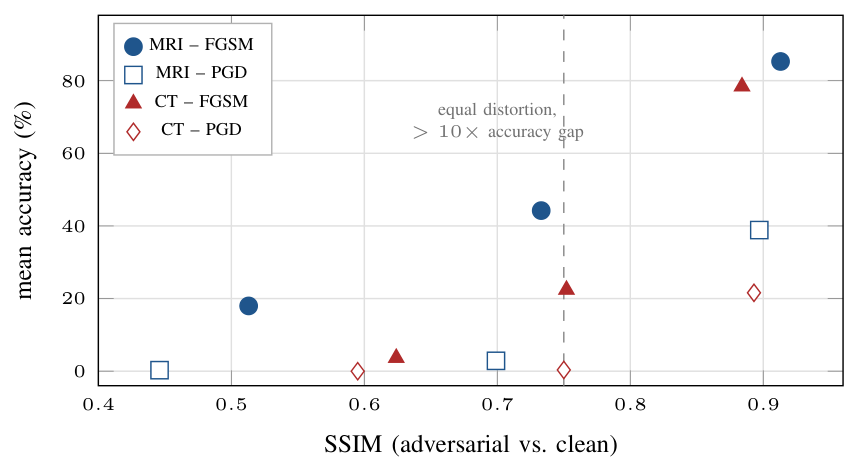
</p>

Image quality of adversarial examples (reference backbone: Xception):

| Metric | MRI FGSM 0.02 | 0.05 | 0.10 | MRI PGD 0.02 | 0.05 | 0.10 | CT FGSM 0.02 | 0.05 | 0.10 | CT PGD 0.02 | 0.05 | 0.10 |
|---|---:|---:|---:|---:|---:|---:|---:|---:|---:|---:|---:|---:|
| SSIM ↑ | 0.913 | 0.733 | 0.513 | 0.897 | 0.699 | 0.446 | 0.884 | 0.752 | 0.624 | 0.893 | 0.750 | 0.595 |
| MS-SSIM ↑ | 0.989 | 0.947 | 0.842 | 0.978 | 0.918 | 0.783 | 0.993 | 0.963 | 0.892 | 0.992 | 0.961 | 0.875 |
| PSNR (dB) ↑ | 37.10 | 29.50 | 23.12 | 35.77 | 28.91 | 22.62 | 37.39 | 29.79 | 23.42 | 35.93 | 28.93 | 22.88 |
| RMSE ↓ | 3.56 | 8.55 | 17.80 | 4.16 | 9.16 | 18.87 | 3.44 | 8.26 | 17.20 | 4.08 | 9.12 | 18.31 |

<sub>Values as reported in the paper (Tables VII–VIII). <code>scripts/image_similarity.py</code> recomputes every metric as the mean over the full test set and also saves per-image scores.</sub>

At essentially the **same distortion** (SSIM ≈ 0.75, PSNR ≈ 29 dB), FGSM leaves **22.4 – 44.2 %** accuracy while PGD leaves **0.35 – 2.85 %**. That is more than an order of magnitude difference, and **no image-quality metric registers it**. Detectors that threshold SSIM, PSNR and similar metrics will miss exactly the attacks that matter most.

### 7. What the attacks look like

| CT Kidney – FGSM | Brain MRI – PGD |
|---|---|
| 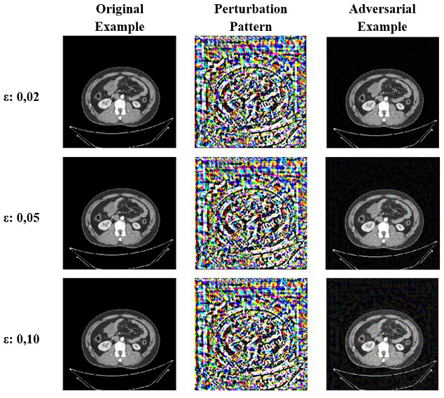 |  |

Each panel shows the original image, the perturbation pattern, and the adversarial result at ε ∈ {0.02, 0.05, 0.10}.

---

## 💡 What this means in practice

1. **Clean accuracy says nothing about robustness.** Leaderboards built on clean test accuracy cannot be used to pick models for adversarial settings.
2. **Iteration beats budget.** How well an attacker *searches* the ε-ball matters more than how big the ball is. Limiting the visible perturbation is not enough.
3. **Quality metrics are the wrong detector.** Detection has to look at the model's internal response, not at the pixels.
4. **Architecture selection is a mitigation, not a defence.** A better backbone buys margin at small budgets; it does not buy safety.
5. **Protect the image path.** Perturbations of ±5 to ±26 grey levels are enough. Deployments need signed DICOM transfer, checksummed pre-processing and provenance logging, **plus** model-level defences such as adversarial training.

---

## ⚠️ Limitations

1. **Patient-level leakage:** the split is stratified by class but not grouped by patient (the public datasets have no patient IDs). Clean accuracies, especially 100 % on CT, should be read as an **upper bound**. All adversarial comparisons are paired within a dataset, which limits the impact.
2. **Single training run:** each architecture was trained once per dataset, so seed variance is not separated from architectural robustness.
3. **Attack coverage:** only two first-order white-box L∞ attacks, with 5 PGD iterations. AutoAttack, C&W, DeepFool and transfer attacks are natural next steps.
4. **No defence baseline:** adversarial training, TRADES and randomised smoothing are future work.
5. **No attribution or calibration analysis:** Grad-CAM and confidence-under-attack would test *why* CT is more fragile.
6. **ImageNet pretraining only:** medical-domain pretraining may change the MRI/CT gap.

---

## 📁 Repository structure

```
adversarial-threats-medical-ai/
├── paper/
│   └── adversarial-threats-medical-ai.pdf   ← the full paper
├── medattack/                               ← reusable Python package
│   ├── config.py        experiment settings, dataset definitions, paths
│   ├── data.py          image loading, binarisation, 80/10/10 split
│   ├── models.py        20 backbones + two-phase transfer learning
│   ├── attacks.py       FGSM and PGD
│   ├── evaluation.py    accuracy, precision, recall, F1, specificity
│   ├── similarity.py    SSIM, MS-SSIM, PSNR, ... between clean & adversarial images
│   └── plots.py         confusion matrices, ROC curves, attack examples
├── scripts/                                 ← command-line entry points
│   ├── prepare_data.py      step 1 – raw images → NumPy arrays
│   ├── train.py             step 2 – fine-tune the backbones
│   ├── attack.py            step 3 – FGSM / PGD evaluation
│   └── image_similarity.py  step 4 – how visible are the attacks?
├── results/                                 ← all numbers reported in the paper
│   ├── all_results.csv            280 evaluations × 5 metrics
│   ├── accuracy_matrix.csv        20 models × 14 conditions (+ mean)
│   ├── training_summary.csv       parameters, epochs, training time
│   ├── image_quality_xception.csv distortion metrics (Tables VII–VIII)
│   └── original-excel/            the original result spreadsheets
├── assets/                                  ← figures used in this README
├── requirements.txt
├── CITATION.cff
└── LICENSE
```

---

## 🧩 Code walkthrough

The experiments were first run in Google Colab notebooks: one notebook per dataset × attack, plus an image-similarity notebook per dataset. Their cells were repeated for each of the 20 models. For this repository the code was converted into a small **Python package** plus **four scripts**. They keep the same logic and hyper-parameters, with a single loop over the backbones.

| Original notebook | Now |
|---|---|
| `BrainMRI_FGSM` / `KidneyCT_FGSM` (data prep + training + FGSM) | `scripts/prepare_data.py`, `scripts/train.py`, `scripts/attack.py --attack fgsm` |
| `BrainMRI_PGD` / `KidneyCT_PGD` | `scripts/attack.py --attack pgd` |
| `BrainMRI_benzerlik` / `KidneyCT_benzerlik` (*benzerlik* = similarity) | `scripts/image_similarity.py` |

### `medattack/models.py`: one recipe for 20 backbones

Every backbone is registered with its own official `preprocess_input`, and the classifier is assembled the same way for all of them:

```python
BACKBONES = {
    "Xception":    (apps.Xception,    apps.xception.preprocess_input),
    "InceptionV3": (apps.InceptionV3, apps.inception_v3.preprocess_input),
    ...  # 20 in total
}

def build_classifier(name):
    constructor, preprocess_input = BACKBONES[name]
    base_model = constructor(include_top=False, weights="imagenet", input_shape=(224, 224, 3))
    base_model.trainable = False

    inputs = tf.keras.Input(shape=(224, 224, 3))
    x = tf.keras.layers.GaussianNoise(0.01)(inputs)   # active during training only
    x = preprocess_input(x)
    x = base_model(x, training=False)
    x = tf.keras.layers.Flatten()(x)
    outputs = tf.keras.layers.Dense(2, activation="softmax")(x)
    return tf.keras.Model(inputs, outputs), base_model
```

`train()` then runs **phase 1** (frozen backbone, Adam 1e-4) and **phase 2** (all layers unfrozen, elastic-net penalty on every Conv2D kernel, Adam 1e-5), both with early stopping. It saves the model, the training histories and a `training_summary.json`.

### `medattack/attacks.py`: FGSM and PGD

Both attacks share one helper that computes the input gradient with `tf.GradientTape`:

```python
def _loss_gradient(model, images, labels):
    images = tf.convert_to_tensor(images, dtype=tf.float32)
    with tf.GradientTape() as tape:
        tape.watch(images)
        probs = model(images, training=False)
        loss = tf.reduce_sum(tf.keras.losses.sparse_categorical_crossentropy(labels, probs))
    return tape.gradient(loss, images)
```

PGD repeats a signed step, keeps the image valid, and projects it back into the ε-ball:

```python
def pgd(model, x_batch, y_batch, epsilon, alpha, num_iter, clip_min=0.0, clip_max=1.0):
    adv = np.copy(x_batch)
    for _ in range(num_iter):
        grad = _loss_gradient(model, adv, y_batch)
        adv = adv + alpha * tf.sign(grad).numpy()
        adv = np.clip(adv, clip_min, clip_max)                    # valid image
        adv = np.clip(adv, x_batch - epsilon, x_batch + epsilon)  # projection onto the ε-ball
    return adv
```

PGD runs in mini-batches (13 images for MRI, 23 for CT) to fit into GPU memory. Batching changes only the run time, not the perturbations.

### `medattack/evaluation.py`: metrics that respect class imbalance

`binary_metrics()` builds the confusion matrix with **Tumour as the positive class** and returns accuracy, precision, recall (sensitivity), F1, specificity and false-positive rate. Undefined ratios (e.g. precision when the model never predicts "Tumour") come back as `NaN`, shown as "–" in the paper's tables.

### `medattack/similarity.py`: measuring visibility

Wraps the [`sewar`](https://github.com/andrewekhalel/sewar) library to score every clean/adversarial pair with SSIM, MS-SSIM, UQI, VIFP, PSNR, MSE, RMSE (plus ERGAS, SCC, RASE, SAM) on 8-bit images. It returns per-image scores and their means.

### `scripts/attack.py`: the evaluation loop (Algorithm 1)

```
for each backbone:
    load the fine-tuned model
    evaluate on the clean test set
    for ε in (0.02, 0.05, 0.10):
        x_adv ← FGSM(model, x_test, ε)   or   PGD(model, x_test, ε, α, n=5)
        record accuracy, precision, recall, F1, specificity
        save confusion matrix + before/after example image
    save ROC curves over all ε
→ results/<attack>_results.csv
```

---

## 🚀 Reproducing the experiments

### 1. Install

```bash
git clone https://github.com/OudoumAlihoumed/adversarial-threats-medical-ai.git
cd adversarial-threats-medical-ai
python -m venv .venv && source .venv/bin/activate      # Windows: .venv\Scripts\activate
pip install -r requirements.txt
```

A GPU is strongly recommended. The original experiments ran on Google Colab (A100 / T4 GPUs and a TPU).

### 2. Download the data

Download both Kaggle datasets and arrange them like this:

```
data/
├── brain_mri/
│   ├── Training/{glioma, meningioma, notumor, pituitary}/
│   └── Testing/{glioma, meningioma, notumor, pituitary}/
└── kidney_ct/
    ├── Normal/
    └── Tumor/          # the Cyst and Stone folders are not needed
```

### 3. Run the pipeline

```bash
# Step 1 – cache images as NumPy arrays and create the 80/10/10 split
python -m scripts.prepare_data --dataset brain_mri
python -m scripts.prepare_data --dataset kidney_ct

# Step 2 – fine-tune all 20 backbones (or pick some with --models)
python -m scripts.train --dataset brain_mri
python -m scripts.train --dataset kidney_ct --models InceptionV3 MobileNetV3Small

# Step 3 – attack them
python -m scripts.attack --dataset brain_mri --attack fgsm
python -m scripts.attack --dataset brain_mri --attack pgd
python -m scripts.attack --dataset kidney_ct --attack fgsm
python -m scripts.attack --dataset kidney_ct --attack pgd

# Step 4 – image-quality metrics of the adversarial examples (Xception)
python -m scripts.image_similarity --dataset brain_mri
python -m scripts.image_similarity --dataset kidney_ct
```

Everything is written to `outputs/<dataset>/`: `models/` (trained `.h5` files), `results/` (CSV tables) and `figures/` (training curves, confusion matrices, ROC curves, attack examples).

### Running on Google Colab

```python
from google.colab import drive
drive.mount('/content/drive')

!git clone https://github.com/OudoumAlihoumed/adversarial-threats-medical-ai.git
%cd adversarial-threats-medical-ai
!pip install -q sewar==0.4.6

import os
os.environ["MEDATTACK_ROOT"] = "/content/drive/MyDrive/medattack"   # data/ and outputs/ live here
!python -m scripts.prepare_data --dataset brain_mri
```

With `MEDATTACK_ROOT` set, the datasets are read from `<MEDATTACK_ROOT>/data/` and all trained models and results are saved to Drive, so nothing is lost when the Colab session disconnects.

> **Note on exact numbers:** the random split depends on the order in which image files are listed. The notebooks ran on Google Drive; the scripts sort file names so that runs are deterministic. Re-running will therefore give very close, but not bit-identical, numbers to those in `results/`.

---

## 📖 Citation

If you use this code or the benchmark results, please cite:

```bibtex
@misc{alihoumed2026adversarial,
  author       = {Ali Houmed, Oudoum},
  title        = {Adversarial Threats to Safety-Critical Medical {AI}: A Security Assessment
                  of 20 Deep Learning Tumour Detectors in Brain {MRI} and Kidney {CT}},
  year         = {2026},
  institution  = {Gazi University, Ankara, Turkey},
  howpublished = {\url{https://github.com/OudoumAlihoumed/adversarial-threats-medical-ai}}
}
```

---

## 👤 Author

**Oudoum Ali Houmed**, Gazi University, Ankara, Turkey
GitHub: [@OudoumAlihoumed](https://github.com/OudoumAlihoumed)

## 📄 License

The **code** is released under the [MIT License](LICENSE). The **paper** and its figures are © Oudoum Ali Houmed, all rights reserved. The datasets belong to their original authors; see the Kaggle pages linked above for their licences.
